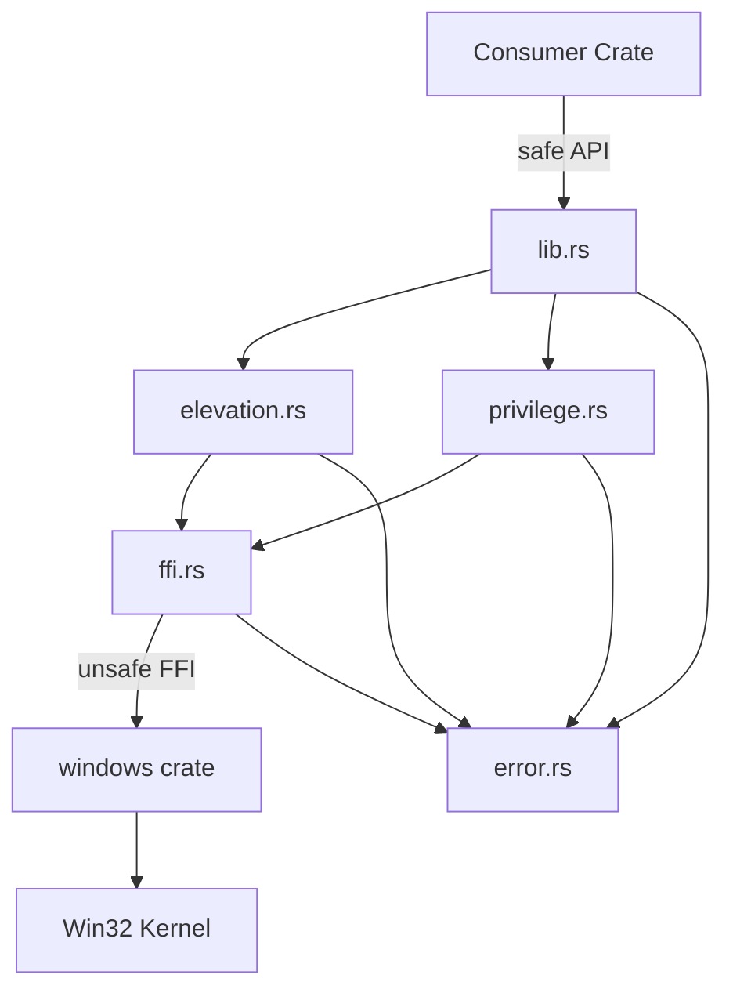

# token-privilege

[](https://github.com/EvilBit-Labs/token-privilege/actions/workflows/ci.yml) [](https://crates.io/crates/token-privilege) [](https://docs.rs/token-privilege) [](LICENSE-MIT)

Safe Rust wrapper for Windows process token privilege and elevation detection.

## Why

Windows privilege and elevation checks require verbose, unsafe Win32 FFI calls that are easy to get wrong. `token-privilege` wraps these APIs behind a safe, ergonomic Rust interface so you can query token state without writing any `unsafe` code yourself.

All unsafe Win32 FFI is confined to a single internal module (`ffi.rs`). Consumers can use `#![forbid(unsafe_code)]` in their own crates while relying on `token-privilege` for privilege detection.

On non-Windows platforms, all public functions return `Err(TokenPrivilegeError::UnsupportedPlatform)`, allowing cross-platform compilation without `#[cfg]` guards in your code.

## Features

- **Elevation detection** -- check if the current process is running as Administrator via UAC.
- **Privilege queries** -- check whether a specific privilege is present or enabled on the process token.
- **Privilege enumeration** -- list all privileges on the current token with their status (enabled, enabled by default, removed).
- **Well-known constants** -- the `privileges` module provides compile-time constants for standard Windows privilege names.
- **Read-only** -- the crate never modifies privileges, only queries them.
- **Cross-platform stubs** -- compiles on Linux and macOS with graceful error returns.
- **Zero unsafe for consumers** -- all FFI is internal; your crate stays `#![forbid(unsafe_code)]`.

## Quick Start

Add the dependency:

```toml
[dependencies]
token-privilege = "0.1"
```

Query elevation and privileges:

```rust,no_run
use token_privilege::{is_elevated, is_privilege_enabled, privileges};

fn main() -> Result<(), Box<dyn std::error::Error>> {
    if is_elevated()? {
        println!("Running as Administrator");
    }

    if is_privilege_enabled(privileges::SE_DEBUG)? {
        println!("SeDebugPrivilege is enabled");
    }

    Ok(())
}
```

## Architecture



| File           | Responsibility                                                        |
| -------------- | --------------------------------------------------------------------- |
| `lib.rs`       | Public API, re-exports, module declarations, stubs                    |
| `elevation.rs` | `is_elevated()` implementation                                        |
| `privilege.rs` | `is_privilege_enabled()`, `has_privilege()`, `enumerate_privileges()` |
| `error.rs`     | `TokenPrivilegeError` enum (uses `thiserror`)                         |
| `ffi.rs`       | All unsafe Win32 FFI, RAII handle wrapper (`pub(crate)` only)         |

## Safety

- All `unsafe` code is isolated in `ffi.rs` and is not publicly exported.
- Every `unsafe` block carries a `// SAFETY:` comment (`undocumented_unsafe_blocks = "deny"` in Clippy config).
- Win32 `HANDLE` values use an RAII wrapper that calls `CloseHandle` on `Drop`.
- `clippy::unwrap_used` and `clippy::panic` are denied crate-wide.
- The crate is read-only -- it never enables, disables, or removes privileges.

## Security

If you discover a security vulnerability, please report it through [GitHub Private Vulnerability Reporting](https://github.com/EvilBit-Labs/token-privilege/security/advisories/new) or email [security@evilbitlabs.io](mailto:security@evilbitlabs.io).

See [SECURITY.md](SECURITY.md) for full details.

## License

Licensed under either of

- [Apache License, Version 2.0](LICENSE-APACHE)
- [MIT License](LICENSE-MIT)

at your option.

### Contribution

Unless you explicitly state otherwise, any contribution intentionally submitted for inclusion in the work by you, as defined in the Apache-2.0 license, shall be dual licensed as above, without any additional terms or conditions.
