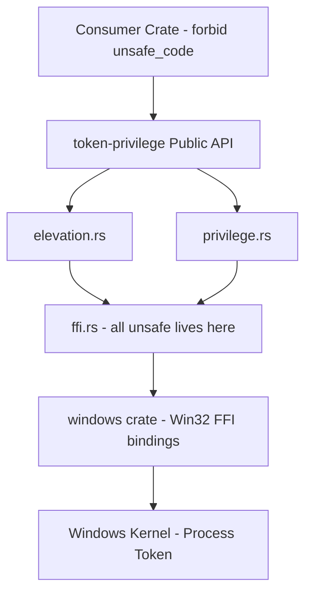

# Architecture Overview

`token-privilege` uses a layered architecture that isolates all `unsafe` FFI code behind a safe public API. This page describes how the layers fit together.

[TOC]

## Layer Diagram

## Module Responsibilities

### `lib.rs` -- Public API

The crate root declares modules, re-exports public types, and provides the top-level function signatures. On Windows, each function delegates to the corresponding domain module. On non-Windows, each function is a `const fn` stub returning `Err(TokenPrivilegeError::UnsupportedPlatform)`.

Public exports:

- `is_elevated()`
- `is_privilege_enabled(privilege_name)`
- `has_privilege(privilege_name)`
- `enumerate_privileges()`
- `PrivilegeInfo` struct
- `TokenPrivilegeError` enum
- `privileges` module (well-known constants)

### `elevation.rs` -- Elevation Detection

Contains the Windows-specific implementation of `is_elevated()`. Calls into `ffi::open_current_process_token()` and `ffi::query_elevation()` to determine whether the process has Administrator elevation via UAC.

### `privilege.rs` -- Privilege Queries

Contains the Windows-specific implementations of:

- `is_privilege_enabled()` -- opens the token, looks up the privilege LUID, and checks if it is enabled via `PrivilegeCheck`.
- `has_privilege()` -- enumerates all token privileges and checks whether the named privilege appears in the list.
- `enumerate_privileges()` -- opens the token and enumerates all privileges with their status flags.

### `ffi.rs` -- FFI Boundary

The **only** module containing `unsafe` code. All Win32 API calls are wrapped in safe `pub(crate)` functions:

| Function                       | Win32 API Called        | Purpose                           |
| ------------------------------ | ----------------------- | --------------------------------- |
| `open_current_process_token()` | `OpenProcessToken`      | Open the current process token.   |
| `query_elevation()`            | `GetTokenInformation`   | Query token elevation status.     |
| `lookup_privilege_value()`     | `LookupPrivilegeValueW` | Resolve a privilege name to LUID. |
| `check_privilege_enabled()`    | `PrivilegeCheck`        | Check if a privilege is enabled.  |
| `enumerate_token_privileges()` | `GetTokenInformation`   | List all token privileges.        |
| `lookup_privilege_name()`      | `LookupPrivilegeNameW`  | Resolve a LUID to a name.         |

### `error.rs` -- Error Types

Defines `TokenPrivilegeError`, a `#[non_exhaustive]` enum built with `thiserror`. Each variant maps to a specific failure mode in the Win32 call chain.

## Data Flow

A typical call to `is_privilege_enabled("SeDebugPrivilege")` follows this path:

1. `lib.rs` dispatches to `privilege::is_privilege_enabled()`.
2. `privilege.rs` calls `ffi::open_current_process_token()` to get an `OwnedHandle`.
3. `privilege.rs` calls `ffi::lookup_privilege_value("SeDebugPrivilege")` to resolve the name to a `LUID`.
4. `privilege.rs` calls `ffi::check_privilege_enabled(&token, luid)` to perform the actual privilege check.
5. The `OwnedHandle` is dropped, calling `CloseHandle` automatically.
6. The `bool` result propagates back to the consumer.

## Design Constraints

- **`unsafe` is NOT forbidden at crate level.** This crate is the unsafe boundary -- it exists to contain the unsafe code so consumers do not need it.
- **All `unsafe` blocks require `// SAFETY:` comments.** The lint `undocumented_unsafe_blocks = "deny"` enforces this.
- **No panics, no unwraps.** `clippy::panic` and `clippy::unwrap_used` are denied. All fallible operations return `Result`.
- **Read-only.** The crate never calls `AdjustTokenPrivileges` or any other API that modifies the process token.
- **RAII for handles.** The `OwnedHandle` wrapper ensures `CloseHandle` is called on all code paths, including panics and early returns.

## Platform Compilation

The crate uses `#[cfg(target_os = "windows")]` to conditionally compile modules:

- **Windows:** `elevation.rs`, `privilege.rs`, and `ffi.rs` are compiled. The `windows` crate dependency is pulled in.
- **Non-Windows:** Only `lib.rs`, `error.rs`, and the stub functions are compiled. The `windows` crate is not linked.

This is controlled via `[target.'cfg(windows)'.dependencies]` in `Cargo.toml`.
